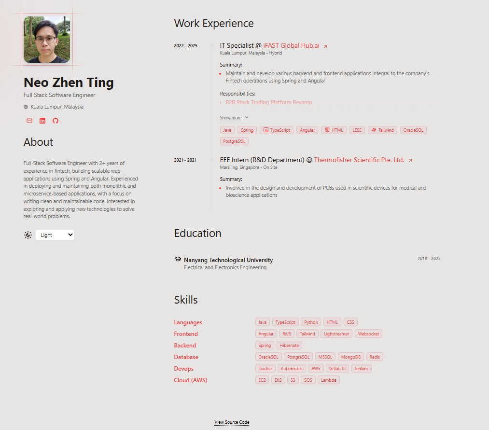
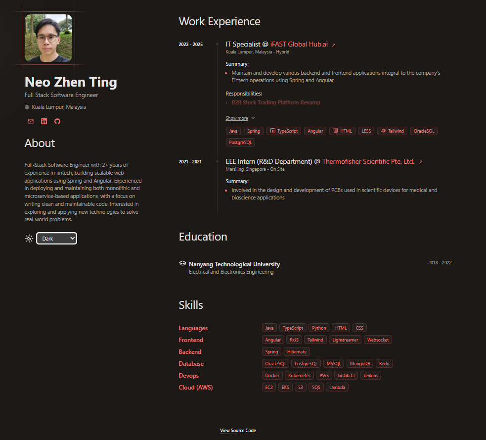
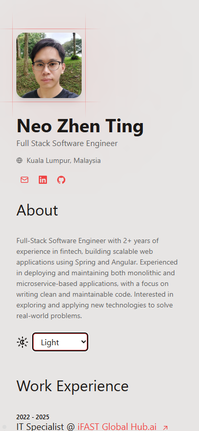
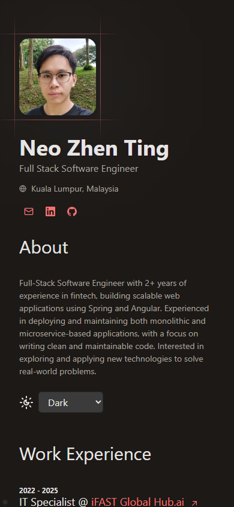

## neozt's CV Website

Website to showcase my CV.  

View the live website here: https://neozt.dev

## 🛠️ Stack

- [**Astro**](https://astro.build/) - The next-gen web framework.
- [**Alpine.js**](https://alpinejs.dev/) - Lightweight JavaScript framework.
- [**TypeScript**](https://www.typescriptlang.org/) - JavaScript with type syntax.
  
## 🚀 Getting Started

1. Run `pnpm run dev` to start local web server.
2. Go to `localhost:4321` to view the website in your browser.

## 💻 Deployment

- The site is deployed on Cloudflare Pages.
- CI/CD is configured for Cloudflare worker to monitor the Github repository and build the latest changes whenever new commits are pushed to `origin/master` branch.
- Commands:
    - `pnpm run build` to build the website into `/dist` folder
    - `npx wrangler dev` to preview the site
    - `npx wrangler deploy` to deploy the site to production

## 📸 Screenshots

Light mode:  

Dark mode:  

Light mode (mobile):  

Dark mode (mobile):  

## Acknowledgements

This project uses [Smileshark - Print-friendly portfolio CV](https://github.com/Smilesharks/dev-portfolio) as a starter template.
