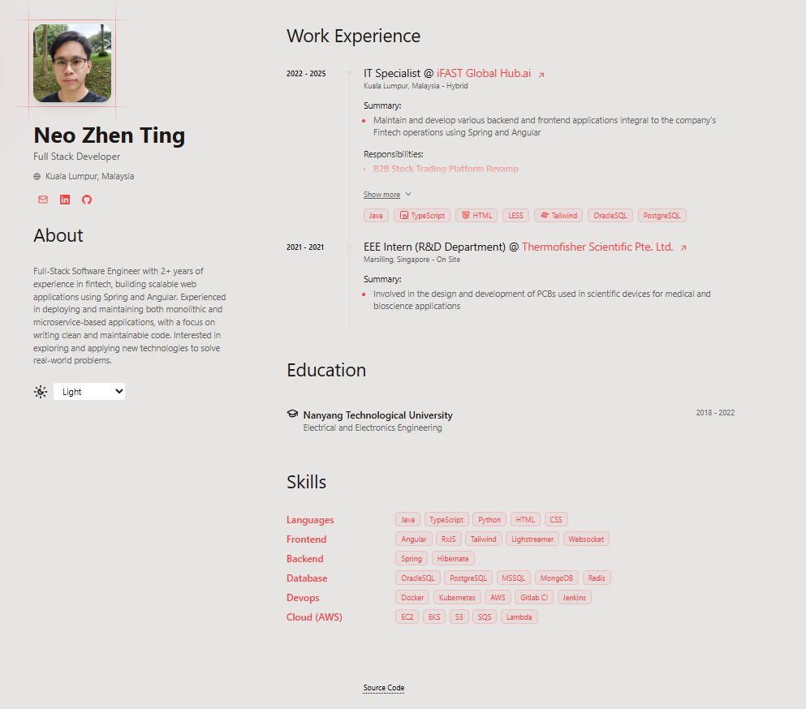

## neozt's CV Website

Website to showcase my CV.

## 🛠️ Stack

- [**Astro**](https://astro.build/) - The next-gen web framework.
- [**TypeScript**](https://www.typescriptlang.org/) - JavaScript with type syntax.

## 🚀 Getting Started

1. Run `npm run dev` to start local web server.
2. Go to `localhost:4321` to view the website in your browser.

## Acknowledgements

This project uses [Smileshark - Print-friendly portfolio CV](https://github.com/Smilesharks/dev-portfolio) as a starter template.